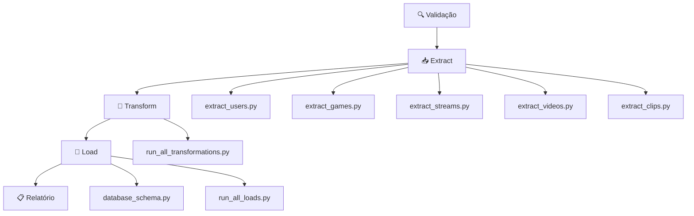

# 🎯 ETAPA 6: ORQUESTRAÇÃO - Pipeline ETL Completo

## 📋 Visão Geral

A Etapa 6 implementa a **orquestração completa** do pipeline ETL, executando todas as etapas em sequência com logs detalhados, tratamento de erros e relatórios finais.

## 🚀 Scripts Disponíveis

### 1. `orchestrator.py` - Orquestrador Principal
**Função**: Executa todo o pipeline ETL em sequência
**Características**:
- ✅ Execução sequencial: Extract → Transform → Load
- ✅ Logs detalhados de cada etapa
- ✅ Tratamento de erros com interrupção segura
- ✅ Estatísticas de tempo e registros processados
- ✅ Relatório final completo

### 2. `run_etl.py` - Execução Rápida
**Função**: Interface simplificada para executar o pipeline
**Uso**: Script mais simples para execução diária

### 3. `validate_setup.py` - Validação de Setup
**Função**: Verifica se tudo está configurado corretamente
**Validações**:
- ✅ Variáveis de ambiente (.env)
- ✅ Dependências Python
- ✅ Arquivos de configuração
- ✅ Conexão PostgreSQL
- ✅ Conexão API Twitch
- ✅ Estrutura de diretórios

## 🔧 Como Usar

### Passo 1: Validar Setup
```bash
# Validar se tudo está configurado
uv run validate_setup.py
```

### Passo 2: Executar Pipeline Completo
```bash
# Opção 1: Orquestrador completo (recomendado)
uv run orchestrator.py

# Opção 2: Execução rápida
uv run run_etl.py
```

## 📊 Relatório de Execução

O orquestrador gera um relatório detalhado com:

```
📋 === RELATÓRIO FINAL DE EXECUÇÃO ===
⏱️ TEMPO DE EXECUÇÃO:
   • Início: 2024-01-15 14:30:00
   • Fim: 2024-01-15 14:35:30
   • Duração Total: 330.45s (5.51 min)

📊 ESTATÍSTICAS POR ETAPA:
   📥 EXTRACT:
      Status: SUCCESS
      Duração: 120.30s
      Registros: 15000

   🔄 TRANSFORM:
      Status: SUCCESS
      Duração: 85.20s
      Registros: 14850

   💾 LOAD:
      Status: SUCCESS
      Duração: 124.95s
      Registros: 14850

📈 TOTAIS:
   • Total de Registros Processados: 44700
   • Taxa de Processamento: 135.23 registros/segundo

✅ NENHUM ERRO ENCONTRADO
🎯 === PIPELINE ETL FINALIZADO ===
```

## 🔄 Fluxo de Execução



## ⚠️ Tratamento de Erros

### Estratégia de Falha
- **Falha no Extract**: Pipeline para, dados não são transformados
- **Falha no Transform**: Pipeline para, dados não são carregados
- **Falha no Load**: Pipeline para, relatório de erro é gerado

### Logs de Erro
Todos os erros são:
- ✅ Logados com detalhes
- ✅ Coletados em lista de erros
- ✅ Incluídos no relatório final
- ✅ Retornados como exit code

## 🎯 Características Técnicas

### Performance
- **Execução Sequencial**: Garante integridade dos dados
- **Estatísticas Detalhadas**: Tempo e registros por etapa
- **Monitoramento**: Logs em tempo real

### Robustez
- **Validação Prévia**: Verifica setup antes de executar
- **Tratamento de Exceções**: Captura e reporta todos os erros
- **Cleanup Automático**: Desconecta recursos automaticamente

### Flexibilidade
- **Modular**: Cada etapa pode ser executada independentemente
- **Configurável**: Usa variáveis de ambiente
- **Extensível**: Fácil adicionar novas validações ou etapas

## 📝 Logs Detalhados

O sistema usa o logger customizado com:
- ✅ Timestamps automáticos
- ✅ Níveis de log (INFO, ERROR)
- ✅ Formatação consistente
- ✅ Emojis para fácil identificação

## 🚨 Troubleshooting

### Erro: "Módulo não encontrado"
```bash
# Verificar se está no diretório correto
cd etl/
uv run validate_setup.py
```

### Erro: "Conexão com banco falhou"
```bash
# Verificar se PostgreSQL está rodando
# Verificar variáveis no .env
```

### Erro: "API Twitch falhou"
```bash
# Verificar token no .env
# Verificar se token não expirou
```

## 🎉 Próximos Passos

Após a Etapa 6, o pipeline ETL está **COMPLETO**! 

Possíveis melhorias futuras:
- 📅 Agendamento automático (cron)
- 📧 Notificações por email
- 📊 Dashboard de monitoramento
- 🔄 Execução incremental
- 📈 Métricas de performance 